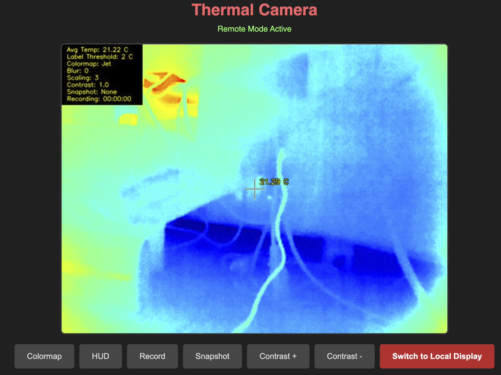

# PyThermalCamera

MLX90640 / Topdon TC001 thermal camera streaming for Raspberry Pi.



## Features

- **Web streaming** via FastAPI with MJPEG
- **Pygame direct display** for kiosk mode (lower CPU)
- **Hybrid mode** - toggle between local display and remote streaming
- Multiple colormaps, contrast control, snapshots, recording
- Raspberry Pi 5 support with Wayland compatibility

## Quick Start

```bash
# Install dependencies
sudo apt-get install python3-opencv python3-fastapi python3-uvicorn

# Run
python3 src/main.py
```

Web UI at `http://<pi-ip>:8000`

## Display Modes

| Mode | Use Case | CPU Usage |
|------|----------|-----------|
| Web only | Remote viewing | Low |
| Pygame | Local kiosk display | Medium |
| Hybrid | Both with toggle button | Higher |

## Kiosk Deployment

Systemd services in `deploy/` for auto-start:

```bash
# Copy services
sudo cp deploy/thermal-*.service /etc/systemd/system/
sudo systemctl daemon-reload
sudo systemctl enable thermal-camera-app.service
sudo systemctl start thermal-camera-app.service
```

See `deploy/` and `RPI Specific Noncamera/` for full kiosk setup with Chromium.

## Controls

| Button | Action |
|--------|--------|
| Colormap | Cycle color schemes |
| HUD | Toggle stats overlay |
| Record | Start/stop video recording |
| Snapshot | Save PNG image |
| Contrast +/- | Adjust contrast |
| Switch Display | Toggle local/remote mode |

## Fork Status

This project originated as a fork of [Les' Laboratory PyThermalCamera](https://github.com/leswright1977/PyThermalcam) but has diverged significantly with a rewritten codebase focused on:
- FastAPI web streaming (replacing OpenCV window)
- Raspberry Pi 5 kiosk deployment
- Hybrid local/remote display modes

Temperature extraction based on [LeoDJ's P2Pro-Viewer](https://github.com/LeoDJ/P2Pro-Viewer).
